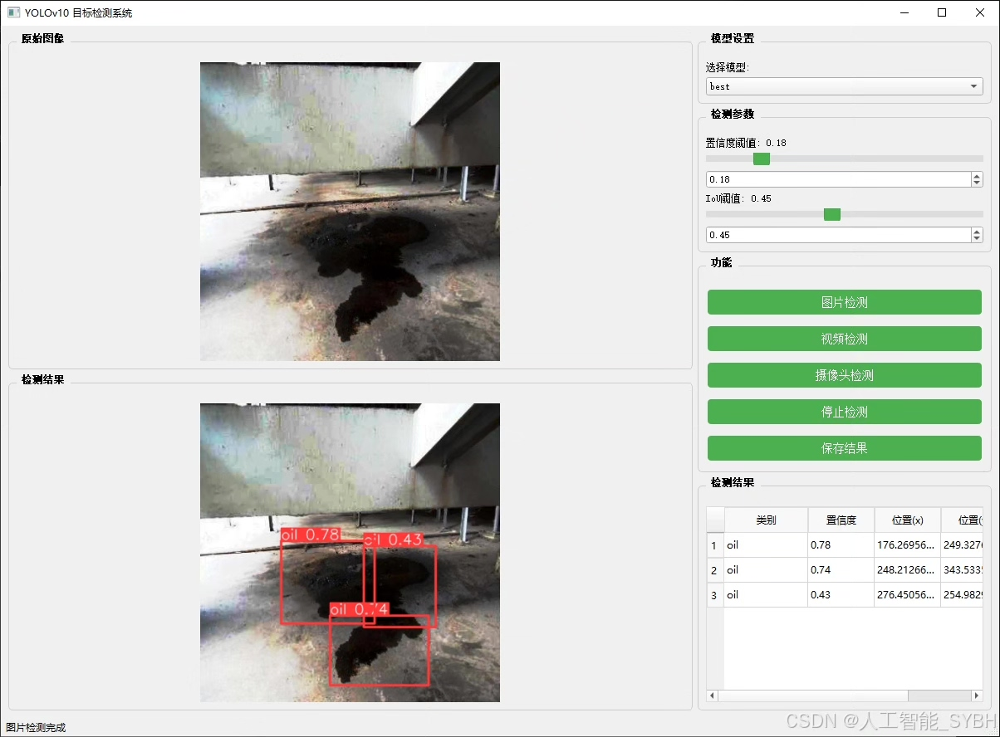
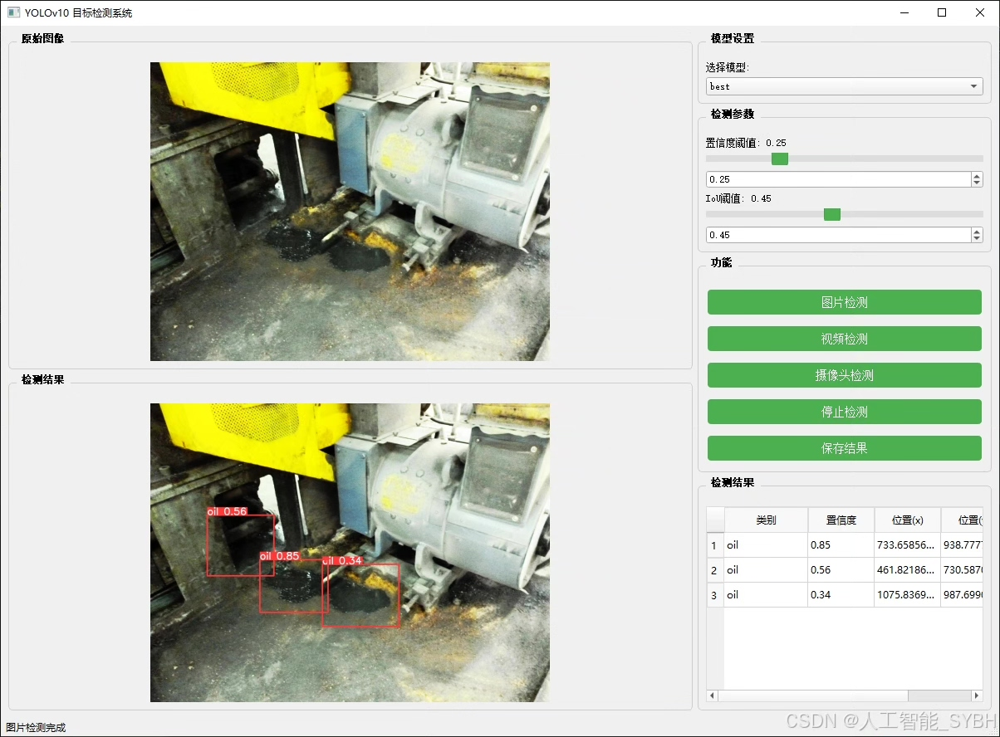
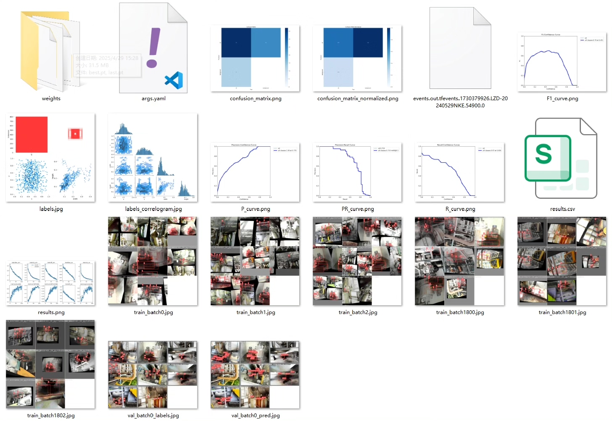
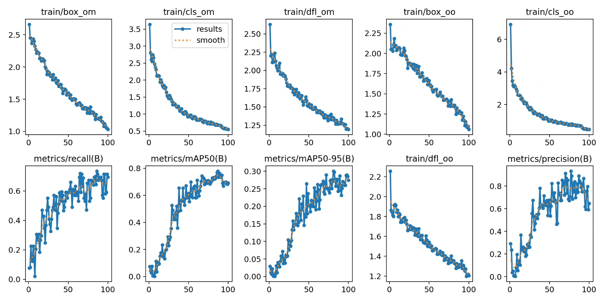
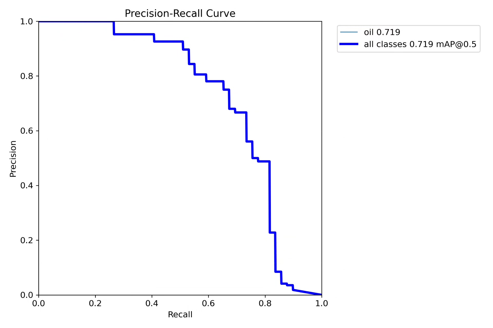
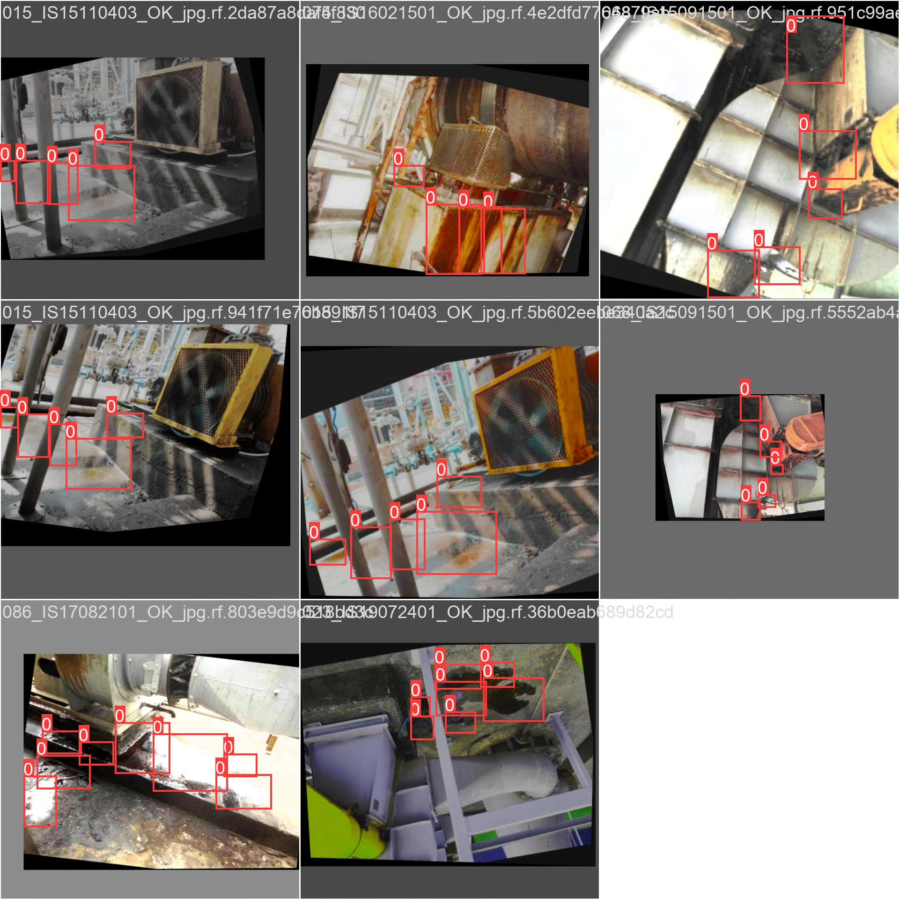
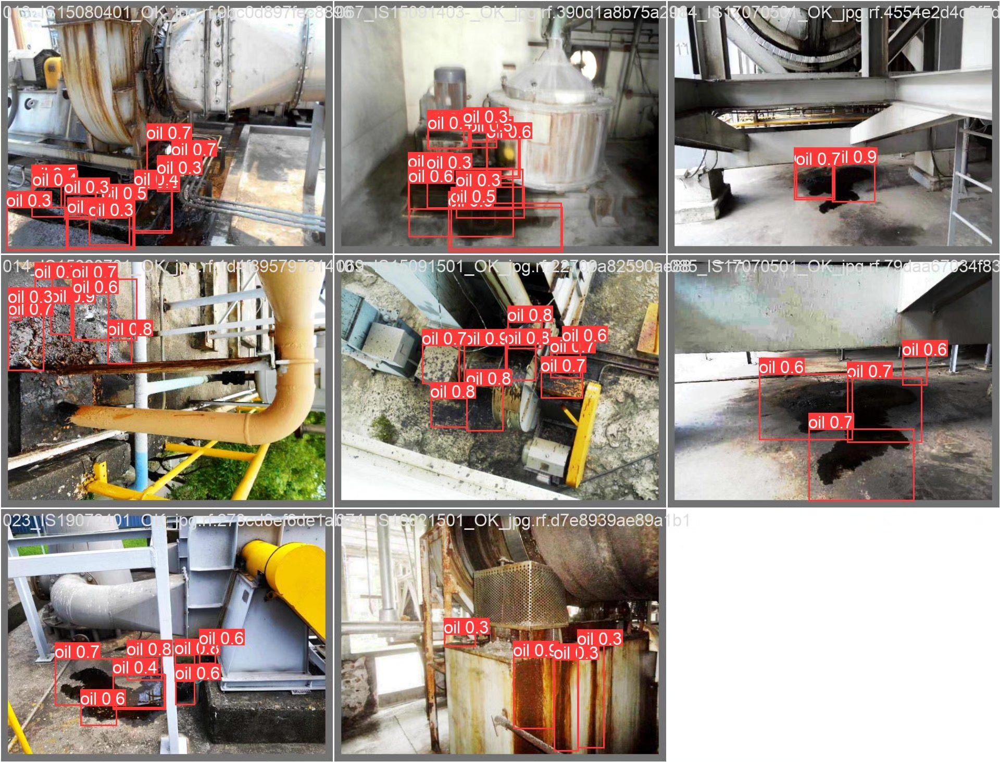

# YOLOv8-based deep learning device leak detection system (YOLOv8+Y)

## Body

This project is based on the YOLOv8 deep learning algorithm and has developed a smart vision system specifically for industrial equipment leak detection. The system is optimized for the single detection category "oil" and uses a dataset of 172 images (156 training images, 16 validation images) for model training. Despite the limited size of the dataset, the system can still effectively identify various types of industrial equipment leaks, including oil leakage at key parts such as pipeline interfaces, valves, and pump bodies.

The company's products have obtained the official commercial license certification from YOLO.

We provide after-sales service.

After payment, we will provide WeChat IDs to answer questions anytime.

Environmental configuration: We will provide a tutorial on environmental configuration and answer questions via WeChat.

Remote installation services: If you need remote configuration, an additional fee of 69 is required. If the configuration fails, all fees will be refunded (specially for old computers only refund installation fees).

Retraining dataset: After configuring the environment, you can train on your own computer. If you need us to retrain, just pay 69 plus computing power fees (2.5 yuan/hour).

Full after-sales service

## Images

## Payment

Here is a pay link on Stripe ( https://buy.stripe.com/3cs8yP7sY87d0vu9AB ). Please contact me lonlonago@foxmail.com after funding $89, and I will send you a complete data files , thank you!

